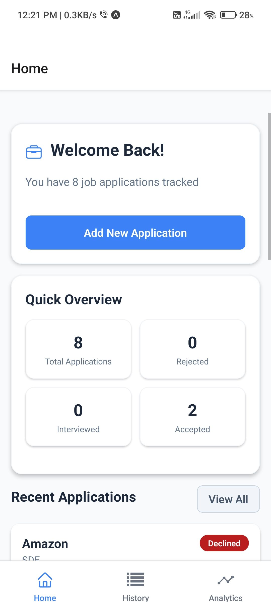
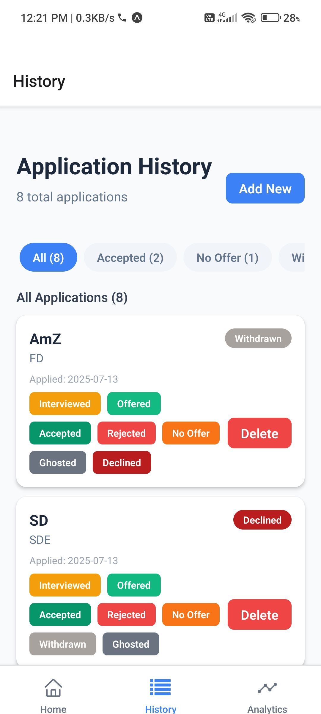
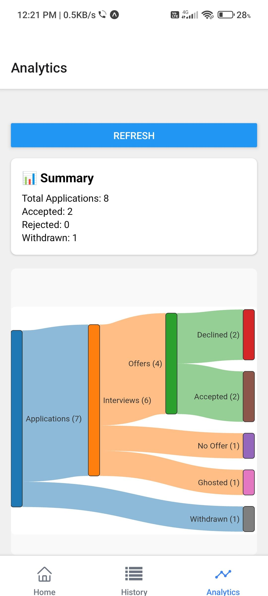

#  Deta - Smart Job Application Tracker

<div align="center">
  
  
  
</div>

<div align="center">
  <h3> Deta is a comprehensive React Native application for tracking job applications with real-time analytics and intelligent insights</h3>
</div>

---

## 📚 Table of Contents

- [Overview](#-overview)
- [Key Features](#-key-features)
- [Tech Stack](#-tech-stack)
- [Screenshots](#-screenshots)
- [Features in Detail](#-features-in-detail)
- [Getting Started](#-getting-started)
- [Download](#-download)
- [Configuration](#-configuration)
- [Architecture Overview](#-architecture-overview)
- [Analytics Features](#-analytics-features)
- [Project Structure](#-project-structure)
- [License](#-license)
- [Author](#-author)
- [Acknowledgments](#-acknowledgments)
- [Future Enhancements](#-future-enhancements)
- [Support](#-support)

---

## 🚀 Overview

**Deta** is a powerful mobile application designed to revolutionize how job seekers manage their application process. Built with React Native, it provides comprehensive tracking capabilities, real-time analytics, and visual insights to help users optimize their job search strategy.

---

## ✨ Key Features

-  **Application Tracking** – Store and manage all your job applications in one place  
-  **Real-time Analytics** – Generate insights based on your application data  
-  **Interactive Charts** – Visual flow charts and graphs for better understanding  
-  **Cross-platform** – Works seamlessly on both iOS and Android  
-  **MVVM Architecture** – Clean separation of concerns with Model-View-ViewModel  
-  **Local Storage** – Secure local data storage using AsyncStorage  
-  **Backend Ready** – Spring Boot REST API developed (integration pending)  
-  **Offline First** – Works seamlessly without internet connection  
-  **Interview Management** – Track interview schedules and outcomes  
-  **Success Metrics** – Monitor application success rates and response times  

---

## 🛠️ Tech Stack

- **Frontend**: React Native, React Navigation  
- **Architecture**: MVVM (Model-View-ViewModel) Pattern  
- **Backend**: Spring Boot (Java) – Currently in Development 
- **Local Storage**: AsyncStorage  
- **Charts**: React Native SVG / D3 - Sankey Charts  
- **State Management**: Redux / Context API with MVVM  
- **Data Persistence**: AsyncStorage (local-only)  
- **Future Integration**: REST API ready for Spring Boot connection  

---

## 📱 Screenshots

<div align="center">
  
  
  
</div>

---

## 🎯 Features in Detail

### Application Management
- Add new job applications with company details  
- Track application status (Applied, Interview, Rejected, Offer)  
- Store important dates and deadlines  
- Add notes and follow-up reminders  

### Analytics Dashboard
- Success rate calculations  
- Response time analysis  
- Application trends over time  
- Industry-wise application distribution  
- Monthly/weekly application statistics  

### Visual Charts
- Application status pie charts  
- Timeline flow charts  
- Success rate trends  
- Industry comparison graphs  
- Interview outcome analytics  

---

## 🚀 Getting Started

### Prerequisites

- Node.js (v14 or higher)  
- React Native CLI  
- Android Studio (for Android development)  
- Xcode (for iOS development)  
- Java JDK 11+ (backend is ready but not connected)  
- Maven (for backend development)  

### Installation

```bash
# Clone the repository
git clone https://github.com/nivas7/deta.git
cd deta

# Install dependencies
npm install
# or
yarn install

# Setup Configuration (Optional - for backend integration)
cp .env.example .env
# Add your Spring Boot API endpoint when ready

# iOS Setup
cd ios && pod install && cd ..

# Run the application
# For Android
npx react-native run-android

# For iOS
npx react-native run-ios

```

## 📦 Download

**Current Version**: v1.0  
- 📱 [Download Deta v1 APK](https://github.com/Nivas7/Deta/blob/rewrite/go/bin/Deta_v1.apk)  
- 🍎 iOS: Coming soon to App Store  

---

## 🔧 Configuration

### MVVM + Local Storage
- Offline-first with AsyncStorage  
- Clean MVVM architecture  
- Fast performance with local operations  
- Privacy-focused: all data remains on user's device  

### Backend Status
- ✅ Backend Developed  
- ⏳ Integration Pending  
- 🔄 Future Plans: Cloud sync and advanced features  

---

## 🏗️ Architecture Overview

### MVVM Pattern

#### Model Layer
- Data models for applications, interviews, and analytics  
- AsyncStorage operations and data persistence  
- Business logic and data validation  

#### View Layer
- React Native components and screens  
- UI rendering and user interactions  
- Navigation and routing  

#### ViewModel Layer
- State management between Model and View  
- Business logic coordination  
- Data formatting for UI consumption  

---

## 📊 Analytics Features

### Data Tracking
- Application submission dates and status updates  
- Interview scheduling and outcomes  
- Company information and position details  
- Personal notes and follow-up reminders  

### Insights
- Success Rate  
- Response Analysis  
- Trend Analysis  
- Company Insights  

---

## 📝 License

This project is licensed under the **MIT License** – see the LICENSE file.

## 👨‍💻 Author

**Nivas**

GitHub: @nivas7

Email: sri112168@gmail.com

## 🙏 Acknowledgments

- React Native community

- Beta testers and contributors

## 🔮 Future Enhancements

[ ] Backend Integration

[ ] Cloud Synchronization

[ ] User Authentication

[ ] Advanced Analytics

[ ] AI-powered Recommendations

[ ] Job Board Integration

[ ] Resume Management

[ ] Interview Preparation

[ ] Team Collaboration

[ ] Data Export/Import

## Access & Feedback

If you are interested in using the **v1** version [v1 - apk Download](https://github.com/Nivas7/Deta/blob/rewrite/go/bin/Deta_v1.apk) or want to provide feedback, please [email us](mailto:sri112168@gmail.com?subject=Deta%20Beta%20Access%20Request) with your  suggestions.
